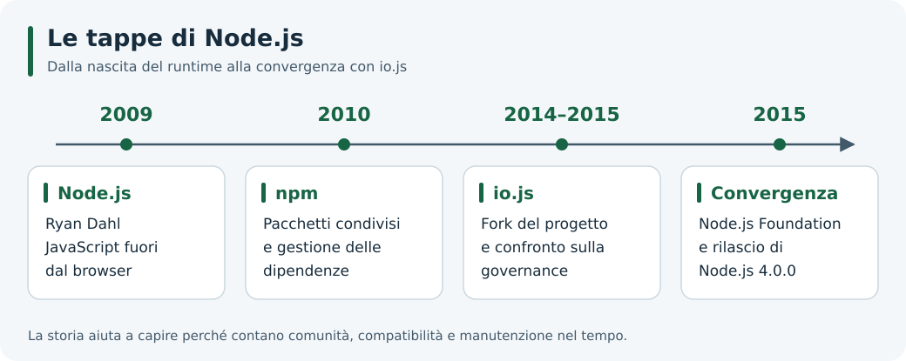

# 1. Node.js: storia, caratteristiche e casi d'uso

## Obiettivi

Al termine saprai distinguere Node.js dal linguaggio JavaScript, descrivere il problema che ha guidato la sua nascita e riconoscere alcuni casi d'uso adatti.

## Che cos'è Node.js?

**JavaScript è il linguaggio; Node.js è un ambiente che lo esegue**, detto *runtime*. Node.js usa il motore V8 e aggiunge API per lavorare con file, rete, processi e altre risorse del sistema operativo.

Nel browser JavaScript può modificare una pagina HTML; con Node.js può, per esempio, leggere un file o rispondere a una richiesta HTTP. Le regole del linguaggio restano le stesse, mentre cambiano le API disponibili. Approfondiremo questa distinzione nella [guida sul runtime](./03-javascript-runtime.md).

Un **server** è un programma che offre un servizio ad altri programmi, chiamati *client*. Node.js può eseguire un server, ma anche uno script che stampa un risultato e termina: non è necessario creare un sito per utilizzarlo.

## Il problema di partenza: attendere senza fermarsi

Un server trascorre parte del tempo in attesa: di dati dalla rete, di un file o di una risposta da un database. Queste sono operazioni di **I/O** (*Input/Output*).

Immagina uno sportello che, mentre aspetta un documento, possa avviare la pratica di un'altra persona. Il tempo necessario a ricevere il documento non diminuisce, ma lo sportello può gestire più pratiche in corso. L'I/O asincrono serve a ottenere un vantaggio simile.

L'analogia ha un limite: quando il codice JavaScript esegue un calcolo lungo sul thread principale, quello stesso thread non può contemporaneamente eseguire un'altra callback. La [guida sull'architettura](./02-architettura.md) spiega questa distinzione.

*Le tappe principali: la tabella seguente ne spiega il significato.*

## Le tappe principali

| Periodo | Evento | Perché conta |
| --- | --- | --- |
| 2009 | Ryan Dahl crea Node.js e lo presenta a JSConf EU a novembre | JavaScript, V8 e I/O orientato agli eventi vengono riuniti in un runtime utilizzabile fuori dal browser |
| 2010 | Nasce npm, sviluppato inizialmente da Isaac Z. Schlueter | Diventa più semplice distribuire e riutilizzare pacchetti |
| 2014–2015 | Nasce il fork io.js, poi ricongiunto a Node.js nel 2015 | La comunità affronta questioni di governance e ritmo di sviluppo |
| 2015 | Nasce la Node.js Foundation; viene pubblicato Node.js 4.0.0 | La versione 4 riunisce il lavoro dei progetti Node.js e io.js |
| Anni successivi | Si consolidano rilasci LTS, Promise, ES Modules e worker threads | Il runtime amplia gli strumenti per mantenere applicazioni e gestire carichi differenti |

Per la presentazione iniziale vedi l'[archivio di JSConf EU 2009](https://www.jsconf.eu/2009/2009/11/index.html). Il [resoconto del maggio 2015](https://nodejs.org/en/blog/weekly/weekly-update2015-05-15) documenta il percorso di ricongiungimento; le [note di Node.js 4.0.0](https://nodejs.org/en/blog/release/v4.0.0) ne descrivono il risultato.

## Node.js, npm e framework

| Nome | Ruolo | Esempio |
| --- | --- | --- |
| JavaScript | Linguaggio | Definire una funzione con `function` |
| V8 | Motore JavaScript | Eseguire il codice e gestire la memoria degli oggetti |
| Node.js | Runtime | Leggere un file tramite `node:fs` |
| npm | Gestore di pacchetti e relativo ecosistema | Installare una dipendenza del progetto |
| Express | Framework installabile separatamente | Organizzare le rotte di un'applicazione web |

npm non fa parte dell'event loop e non serve per eseguire un programma che usa soltanto API integrate. Un framework aggiunge convenzioni e strumenti, ma non è indispensabile per iniziare.

## Dove è utile e quali limiti considerare

| Scenario | Possibile utilità di Node.js | Aspetto da valutare |
| --- | --- | --- |
| API e servizi web | Coordina richieste e attese di rete | Database, algoritmi e limiti delle risorse influenzano le prestazioni |
| Chat e notifiche | Gestisce connessioni ed eventi | Molti utenti richiedono anche una progettazione adeguata dello stato |
| Strumenti da terminale | Automatizza attività usando JavaScript | Percorsi e comandi esterni possono variare tra sistemi operativi |
| Trasferimento di file | Gli stream permettono di elaborare dati a blocchi | Bisogna controllare memoria e velocità di lettura/scrittura |
| Calcoli pesanti o elaborazione video | Può coordinare il lavoro | Il calcolo sul thread principale rallenta le altre richieste; possono servire worker, processi o servizi dedicati |

Usare lo stesso linguaggio nel frontend e nel backend facilita il riuso di alcune competenze. Il codice che dipende dal DOM o dal file system richiede comunque un ambiente appropriato. Una SPA gira principalmente nel browser; Node.js può fornirne il backend o gli strumenti di sviluppo.

## Prova ragionata

Per ogni attività scegli se prevalgono attesa di I/O o calcolo:

1. Ricevere una risposta da un database remoto.
2. Calcolare tutti i numeri primi fino a un limite molto alto.
3. Inviare aggiornamenti a una chat.

Soluzione commentata

1. Prevale l'attesa di I/O, anche se il database può svolgere calcoli al proprio interno.
2. Prevale il lavoro della CPU: eseguirlo a lungo sul thread principale riduce la reattività.
3. Prevale normalmente l'I/O di rete; trasformazioni costose dei messaggi possono però cambiare il carico.

La scelta dipende dal lavoro effettivo, non soltanto dal nome dell'applicazione.

## Da ricordare

Node.js esegue JavaScript fuori dal browser e offre API di sistema. Il suo modello permette di gestire più operazioni in corso, ma non rende automaticamente parallelo ogni calcolo. LTS indica una politica di supporto: consulta il [calendario ufficiale](https://nodejs.org/en/about/previous-releases) prima di scegliere una versione per un progetto.

## Navigazione

- [Indice dell'unità](./README.md)
- [Guida successiva: Architettura](./02-architettura.md)
