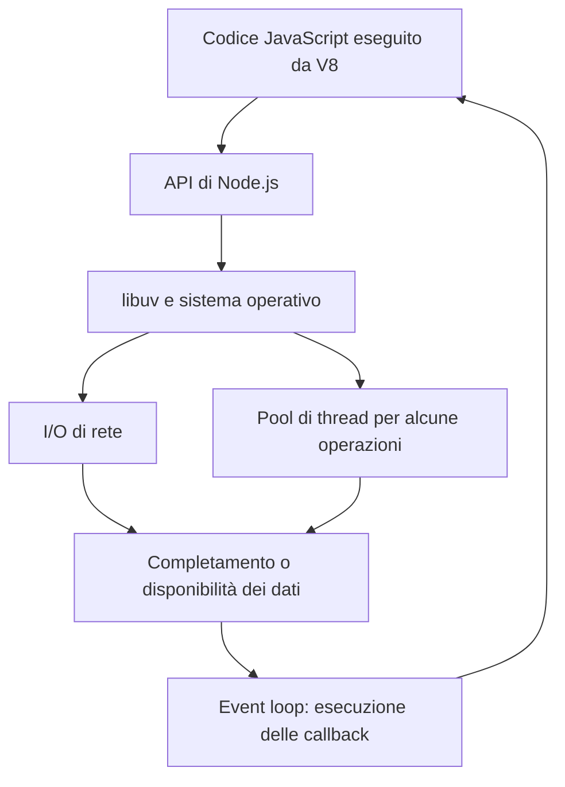
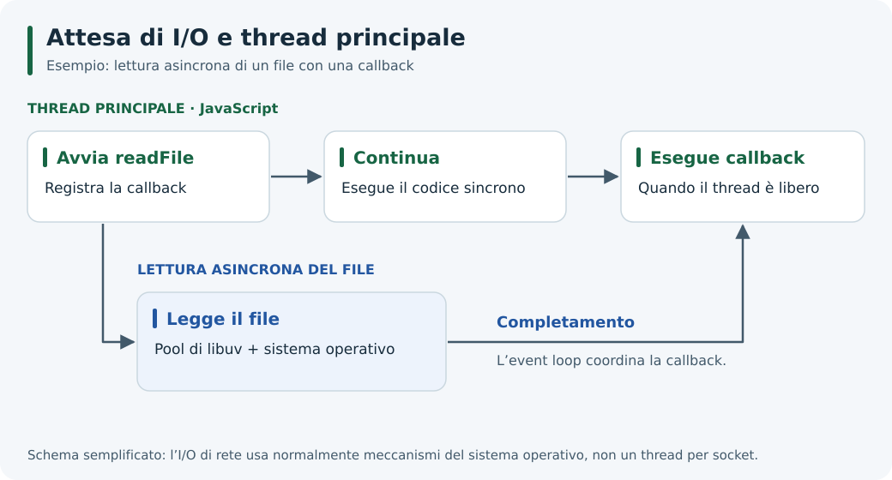

# 2. Architettura di Node.js

## Obiettivi

Capire il ruolo di V8, libuv e delle API integrate; distinguere concorrenza e parallelismo; prevedere l'ordine di semplici operazioni sincrone e asincrone.

## I componenti e le responsabilità

| Componente | Responsabilità |
| --- | --- |
| **V8** | Esegue JavaScript e gestisce la memoria degli oggetti tramite garbage collection |
| **API di Node.js** | Espongono funzionalità come file system, rete, timer ed eventi |
| **libuv** | Fornisce l'event loop e astrazioni di I/O multipiattaforma; gestisce anche un pool di thread |
| **Sistema operativo** | Gestisce risorse come socket, file e notifiche di I/O |

npm è uno strumento esterno per gestire pacchetti: non è un componente coinvolto nell'esecuzione di ogni callback.



Il diagramma è semplificato: mostra la collaborazione dei componenti, non tutte le fasi dell'event loop o le code delle Promise.



*La lettura può procedere mentre JavaScript continua; la callback attende il proprio turno.*

## Che cosa significa “single-threaded”?

Un **thread** è un flusso di esecuzione. Nel modello abituale di Node.js, il codice JavaScript dell'applicazione viene eseguito su un thread principale, una callback alla volta. Il processo può però contenere altri thread usati da V8, libuv e, se creati dall'applicazione, dai worker threads.

Il pool di libuv svolge alcune operazioni, per esempio molte operazioni asincrone sui file e alcune operazioni crittografiche. L'I/O di rete usa normalmente i meccanismi del sistema operativo: non viene assegnato automaticamente un thread a ogni connessione. Vedi la [guida ufficiale su event loop e worker pool](https://nodejs.org/en/learn/asynchronous-work/dont-block-the-event-loop).

- **Concorrenza**: più attività sono in corso nello stesso intervallo di tempo, anche alternando lavoro e attesa.
- **Parallelismo**: più attività vengono eseguite nello stesso istante su risorse di calcolo diverse.

Gestire molte richieste in attesa non implica eseguire contemporaneamente il loro codice JavaScript sul thread principale.

## Primo esperimento: quando parte la callback?

Salva questo codice in `ordine.cjs` ed esegui `node ordine.cjs`:

```javascript
console.log('1. Inizio');

setTimeout(() => {
  console.log('3. Timer');
}, 0);

console.log('2. Fine del codice sincrono');
```

Risultato atteso:

```text
1. Inizio
2. Fine del codice sincrono
3. Timer
```

La chiamata a `setTimeout()` registra una callback e restituisce il controllo. Node.js continua con l'ultima istruzione sincrona; la callback viene eseguita successivamente. Il ritardo richiesto non garantisce un istante esatto di esecuzione. Anche `0` non significa “interrompi adesso il codice corrente”. La [guida all'event loop](https://nodejs.org/en/learn/asynchronous-work/event-loop-timers-and-nexttick) approfondisce timer e fasi.

## Secondo esperimento: leggere un file

Salva in `lettura.cjs` ed esegui `node lettura.cjs`:

```javascript
const { readFile } = require('node:fs');

console.log('A. Avvio lettura');

readFile(__filename, 'utf8', (errore, testo) => {
  if (errore) {
    console.error('Lettura fallita:', errore.message);
    process.exitCode = 1;
    return;
  }

  console.log('C. Il file contiene console.log:', testo.includes('console.log'));
});

console.log('B. Posso continuare');
```

Risultato atteso:

```text
A. Avvio lettura
B. Posso continuare
C. Il file contiene console.log: true
```

`__filename` indica il file CommonJS corrente: così l'esempio legge se stesso e non richiede un file di dati da preparare. `utf8` richiede una stringa; senza codifica si riceverebbe un `Buffer` di byte. La callback segue la convenzione *error-first*: controlla il primo argomento prima di usare il risultato.

Node.js offre anche API sincrone, come `readFileSync()`: durante la lettura bloccano il thread che le chiama. Possono essere appropriate in piccoli script o in fase di avvio, ma vanno valutate nel codice che gestisce richieste concorrenti.

## Asincrono non significa automaticamente non bloccante

Dichiarare una funzione `async` non sposta il suo lavoro su un altro thread. Un ciclo molto lungo al suo interno continua a impegnare il thread su cui viene eseguito. Lo stesso vale per un calcolo avviato dentro una callback di `setTimeout()`.

Per mantenere reattivo un server si possono ridurre i calcoli, suddividerli in porzioni o affidarli a worker threads o processi dedicati. I worker JavaScript sono diversi dal pool interno di libuv. Approfondirai queste scelte nell'[unità sull'architettura event-driven](../02-Architettura_Event-Driven/README.md).

## EventEmitter: gli eventi possono essere sincroni

“Basato su eventi” e “asincrono” non sono sinonimi. Prova `eventi.cjs` con `node eventi.cjs`:

```javascript
const { EventEmitter } = require('node:events');
const sportello = new EventEmitter();

sportello.on('messaggio', (testo) => {
  console.log('2. Ricevuto:', testo);
});

console.log('1. Prima di emit');
sportello.emit('messaggio', 'Ciao');
console.log('3. Dopo emit');
```

Risultato atteso:

```text
1. Prima di emit
2. Ricevuto: Ciao
3. Dopo emit
```

`on()` registra un listener; `emit()` chiama i listener **sincronamente**, nell'ordine di registrazione. Il codice dopo `emit()` prosegue quando i listener hanno restituito il controllo. Se un listener avvia un'operazione asincrona, il suo completamento avverrà separatamente. Questo comportamento è specificato nella [documentazione di EventEmitter](https://nodejs.org/api/events.html#asynchronous-vs-synchronous).

## Verifica

1. Se il codice sincrono impiega due secondi, un timer da 10 ms può interromperlo?
2. `async function calcola() { /* lungo calcolo */ }` crea un worker?
3. Nell'esempio `eventi.cjs`, cosa succede registrando un secondo listener prima di `emit()`?

<details>
<summary>Risposte</summary>

1. No. La callback deve attendere che il thread possa eseguirla; il ritardo effettivo può superare 10 ms.
2. No. `async` riguarda il risultato come Promise e l'uso di `await`, non la creazione di thread.
3. Entrambi i listener vengono chiamati, nell'ordine di registrazione, prima della stampa `3. Dopo emit`.

</details>

## Navigazione

- [Indice dell'unità](./README.md)
- [Guida precedente: Storia e caratteristiche](./01-storia.md)
- [Guida successiva: JavaScript runtime](./03-javascript-runtime.md)
