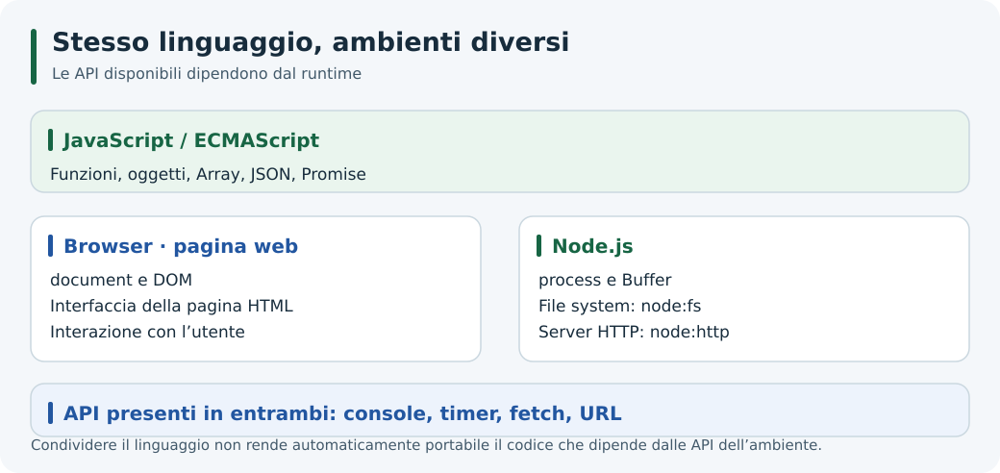
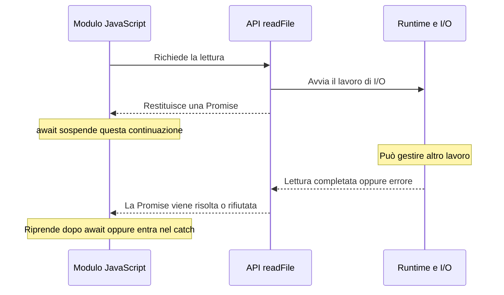

# 3. JavaScript runtime: dal browser a Node.js

## Obiettivi

Distinguere linguaggio, motore e runtime; riconoscere le API disponibili in Node.js; usare argomenti, percorsi e lettura asincrona di file.

## Linguaggio, motore e ambiente

**ECMAScript** definisce il linguaggio JavaScript: sintassi, tipi e funzionalità come array e Promise. Un **motore**, come V8, esegue quel linguaggio. Il **runtime** aggiunge servizi per interagire con l'ambiente circostante.

V8 interpreta ed esegue il codice, può compilarlo e ottimizzarlo durante l'esecuzione e gestisce la memoria degli oggetti. Le API per leggere un file o creare un server sono invece fornite dall'ambiente Node.js.



*Il linguaggio è condiviso; le API dell’ambiente determinano quali operazioni sono possibili.*

## Confronto con il browser

| Funzionalità | Browser, nel contesto di una pagina | Node.js |
| --- | --- | --- |
| `Array`, `JSON`, `Promise` | Sì | Sì |
| `globalThis` | Accesso all'oggetto globale | Accesso all'oggetto globale |
| `window`, `document`, DOM | Sì, per interagire con la pagina | Nessun DOM integrato |
| `console`, timer | Sì | Sì, con possibili differenze di comportamento |
| `fetch`, `URL`, `AbortController` | Sì | Sì nelle versioni usate in queste guide |
| `process`, `Buffer` | Non come API native della pagina | Sì |
| `node:fs`, `node:http` | Non come moduli nativi del browser | Sì |

Node.js implementa anche alcune Web API: è quindi impreciso dire che siano tutte assenti. Consulta le [API globali di Node.js](https://nodejs.org/api/globals.html) e il [confronto ufficiale con il browser](https://nodejs.org/en/learn/getting-started/differences-between-nodejs-and-the-browser).

### Esperimento: riconoscere l'ambiente

Salva in `ambiente.cjs` ed esegui `node ambiente.cjs`:

```javascript
console.log('document:', typeof document);
console.log('process:', typeof process);
console.log('fetch:', typeof fetch);
console.log('console condivisa:', globalThis.console === console);
```

Risultato atteso con Node.js 24 avviato senza opzioni particolari:

```text
document: undefined
process: object
fetch: function
console condivisa: true
```

`typeof` permette di controllare un identificatore assente senza accedere direttamente al suo valore. Nella console del browser, il risultato relativo a `document` sarà diverso.

## Oggetti globali e scope dei moduli

Usa `globalThis` per riferirti all'oggetto globale in modo comune ai diversi ambienti. Node.js offre anche `global`, ma `globalThis` è la forma standard.

Le variabili dichiarate al livello principale di un **file modulo** restano nel suo scope. Non vengono automaticamente condivise con altri file. In CommonJS, `require`, `module`, `exports`, `__filename` e `__dirname` sono valori forniti al modulo: non sono proprietà globali disponibili allo stesso modo in ESM. La [guida sui moduli](./05-moduli-in-node.md) mostra come passare da un formato all'altro.

## Il processo e gli argomenti

Un **processo** è un programma in esecuzione. L'oggetto `process` permette di osservarne alcune caratteristiche:

```javascript
// informazioni.cjs
console.log('Node.js:', process.version);
console.log('Motore V8:', process.versions.v8);
console.log('Sistema:', process.platform);
console.log('Cartella di avvio:', process.cwd());
console.log('Argomenti utente:', process.argv.slice(2));
```

Esegui:

```bash
node informazioni.cjs Anna 18
```

Le prime righe dipendono dall'ambiente; l'ultima stampa:

```text
Argomenti utente: [ 'Anna', '18' ]
```

`18` è una stringa. Per usarla come numero occorre convertirla e controllare che sia valida, per esempio con `Number()` e `Number.isFinite()`.

`process.env` contiene le variabili d'ambiente, normalmente come stringhe. È utile per la configurazione: una variabile assente vale `undefined`.

## Cartella corrente e cartella del modulo

Questi percorsi rispondono a domande diverse:

- `process.cwd()`: da quale cartella stai eseguendo il programma?
- `__dirname` in CommonJS: in quale cartella si trova il modulo corrente?
- `import.meta.url` in ESM: qual è l'URL del modulo corrente?

Un percorso relativo passato a `fs`, come `'./dati.txt'`, viene risolto rispetto alla **cartella corrente del processo**. Un percorso relativo in `require('./calcoli.cjs')` o `import './calcoli.mjs'` viene invece risolto rispetto al **modulo che importa**.

Confondere queste due regole è una causa frequente di file non trovati.

## Leggere un file con Promise e async/await

Nella guida precedente hai visto la versione con callback. Qui usiamo l'API basata su Promise. Salva in `leggi-modulo.mjs` ed esegui `node leggi-modulo.mjs`:

```javascript
import { readFile } from 'node:fs/promises';

try {
  const testo = await readFile(new URL('./leggi-modulo.mjs', import.meta.url), 'utf8');
  console.log('Il modulo contiene import:', testo.includes('import'));
} catch (errore) {
  console.error('Lettura fallita:', errore.code);
  process.exitCode = 1;
}
```

Risultato atteso:

```text
Il modulo contiene import: true
```

Il percorso è costruito rispetto al modulo, perciò funziona anche avviando lo script da un'altra cartella. `readFile()` restituisce una Promise. `await` sospende la continuazione di questo modulo fino al completamento dell'operazione, lasciando al runtime la possibilità di gestire altro lavoro. Il `catch` gestisce un eventuale rifiuto della Promise.

Per osservare l'errore, sostituisci il nome nel `new URL(...)` con un file inesistente: il codice stampa normalmente `ENOENT` e segnala un insuccesso tramite `process.exitCode = 1`.

Le tre forme da riconoscere sono:

| Stile | Come arriva il risultato | Come si gestisce l'errore |
| --- | --- | --- |
| Callback | Argomento della funzione richiamata | Primo argomento, secondo la convenzione error-first |
| Promise | `.then(...)` | `.catch(...)` |
| `async`/`await` | Valore ottenuto con `await` | `try`/`catch` intorno all'attesa |

Una Promise rappresenta un risultato futuro; non implica da sola un nuovo thread.



Lo schema descrive il caso della lettura di un file: a essere sospesa è la continuazione che usa `await`, non tutto il processo.

## Memoria e diagnostica: un primo sguardo

Il *call stack* tiene traccia delle chiamate in corso; la *heap* ospita gli oggetti gestiti da V8. Il garbage collector recupera memoria per oggetti non più raggiungibili. Se un array continua ad accumulare riferimenti a oggetti, questi possono restare raggiungibili e occupare memoria.

Non esiste un unico limite fisso della heap valido per tutte le versioni e le macchine. Puoi interrogare il runtime con `memoria.cjs`:

```javascript
const { getHeapStatistics } = require('node:v8');
const limiteMiB = getHeapStatistics().heap_size_limit / 1024 / 1024;
console.log('Limite heap V8 in MiB:', Math.round(limiteMiB));
```

Il numero varia; non coincide con tutta la memoria del processo. Il significato delle statistiche è descritto nell'[API V8](https://nodejs.org/api/v8.html#v8getheapstatistics).

Per esplorare l'esecuzione con un debugger puoi avviare `node --inspect-brk informazioni.cjs`: il processo attende il collegamento di un debugger, per esempio quello dell'editor. Questo approfondimento non è necessario per completare l'unità.

## Verifica

1. `fetch` disponibile significa che Node.js dispone anche di `document`?
2. Perché `node informazioni.cjs 18` non passa direttamente un numero?
3. Spostandoti in un'altra cartella, cambia `process.cwd()` oppure la posizione del modulo?

<details>
<summary>Risposte</summary>

1. No: le API sono offerte separatamente e Node.js non integra il DOM di una pagina.
2. Il terminale passa argomenti testuali; la conversione spetta al programma.
3. Cambia la cartella di avvio del processo. Il modulo resta nella posizione in cui è salvato.

</details>

## Navigazione

- [Indice dell'unità](./README.md)
- [Guida precedente: Architettura](./02-architettura.md)
- [Guida successiva: REPL](./04-repl.md)
