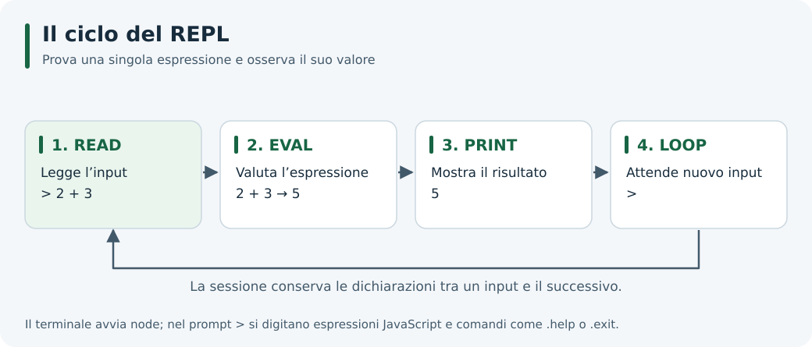

# 4. Il REPL di Node.js

## Obiettivi

Avviare una sessione interattiva, interpretarne l'output, lavorare con variabili e moduli, salvare piccoli esperimenti e riconoscere le differenze rispetto a un file JavaScript.

## Avvio e primo esperimento

**REPL** significa *Read–Eval–Print–Loop*: leggi un'espressione, valutala, mostra il risultato e attendi la successiva.

Dal terminale avvia:

```bash
node
```

Dopo il messaggio di benvenuto compare `>`. Negli esempi seguenti `>` e `...` sono **prompt mostrati da Node.js**, non caratteri da digitare. Le righe senza prompt rappresentano l'output.

```text
> 2 + 3
5
> const nome = 'Anna'
undefined
> `Ciao, ${nome}!`
'Ciao, Anna!'
> console.log('Ciao')
Ciao
undefined
```

`undefined` dopo una dichiarazione non indica un errore: quell'istruzione non produce un valore utile da mostrare. Nell'ultima prova, `Ciao` è stampato da `console.log()`, mentre `undefined` è il valore restituito dalla funzione e mostrato dal REPL.

Digita `.exit` per uscire. Anche `Ctrl+D`, oppure due `Ctrl+C` su una riga vuota, permettono di terminare la sessione. Torna nel terminale prima di eseguire comandi come `node programma.cjs` o `npm --version`.



*Ogni input avvia un nuovo ciclo di lettura, valutazione e stampa.*

## Variabili e contesto della sessione

Le dichiarazioni restano disponibili nella sessione:

```text
> let contatore = 0
undefined
> contatore++
0
> contatore
1
> contatore = contatore + 4
5
```

L'incremento postfisso restituisce il valore precedente: per questo `contatore++` mostra `0`, pur aggiornando la variabile a `1`.

Evita di ridichiarare un nome già introdotto con `let` o `const`: puoi ricevere `SyntaxError: Identifier ... has already been declared`. Per rifare una prova con uno stato pulito, esci e riavvia `node`. Le dichiarazioni `let` e `const` non diventano automaticamente proprietà di `globalThis`.

## Codice multilinea e comandi speciali

```text
> function saluta(persona) {
...   return `Ciao, ${persona}!`;
... }
undefined
> saluta('Luca')
'Ciao, Luca!'
```

Il prompt `...` segnala che l'istruzione non è ancora completa.

| Comando | Utilizzo |
| --- | --- |
| `.help` | Mostra i comandi disponibili |
| `.break` | Abbandona l'istruzione multilinea incompleta |
| `.editor` | Consente di inserire più righe: `Ctrl+D` esegue, `Ctrl+C` annulla |
| `.save prova.js` | Salva il codice immesso nella sessione |
| `.load prova.js` | Legge ed esegue il contenuto del file |
| `.exit` | Chiude il REPL |

Nel REPL avviato con `node`, `.clear` si comporta come `.break`: **non usarlo per cancellare tutte le variabili**. Nei REPL creati tramite API, con contesto separato, può invece reimpostare il contesto. I comportamenti sono descritti nella [documentazione REPL](https://nodejs.org/api/repl.html#commands-and-special-keys).

## Recuperare l'ultimo risultato

La variabile speciale `_` conserva l'ultimo risultato:

```text
> 6 * 7
42
> _ + 8
50
```

Se assegni manualmente un valore a `_`, interrompi il suo aggiornamento automatico. Usa nomi descrittivi per i tuoi esperimenti.

## Importare moduli e usare await

Per un modulo integrato puoi usare `require()`:

```text
> const percorso = require('node:path')
undefined
> percorso.basename('/corso/esempio.txt')
'esempio.txt'
```

Il REPL supporta `await` al livello principale. Per caricare un ES Module usa **l'importazione dinamica** `import()`:

```text
> const { setTimeout: attendi } = await import('node:timers/promises')
undefined
> await attendi(20, 'Pronto')
'Pronto'
```

L'importazione statica `import ... from ...` non è supportata nel REPL standard. `node --input-type=module` non lo trasforma in una console ESM: quell'opzione riguarda codice passato tramite `--eval` o standard input. Per usare importazioni statiche salva il codice in un file `.mjs`, come nella [guida sui moduli](./05-moduli-in-node.md).

### Leggere il contenuto della cartella corrente

```text
> const fileSystem = await import('node:fs/promises')
undefined
> const nomi = await fileSystem.readdir('.')
undefined
> Array.isArray(nomi)
true
> nomi.length >= 0
true
```

Scrivi `nomi` per vedere l'elenco effettivo: dipende dalla cartella da cui hai avviato `node`. Per fare una prova su un file, usa un nome presente nell'elenco. Un errore come `ENOENT` indica che il percorso richiesto non è stato trovato.

## Salvare e ripetere un esperimento

Avvia una **nuova sessione** e digita:

```text
> const prezzi = [10, 20, 30]
undefined
> prezzi.map(prezzo => prezzo * 2)
[ 20, 40, 60 ]
> .save prova-array.js
```

Esci, riavvia `node` nella stessa cartella ed esegui:

```text
> .load prova-array.js
```

Il file viene rieseguito: `.save` conserva il codice, non una fotografia degli oggetti in memoria. Se vuoi poi eseguirlo con `node prova-array.js`, aggiungi `console.log()` per i risultati che desideri stampare. Un file non mostra automaticamente il valore di ogni espressione come fa il REPL.

Una sessione che usa `await` al livello principale potrebbe richiedere un file `.mjs` o una riorganizzazione del codice per essere eseguita come programma.

## Cronologia e scorciatoie

| Tasto | Azione |
| --- | --- |
| Frecce su/giù | Richiamano gli input precedenti |
| `Tab` | Completa nomi e proprietà |
| `Ctrl+R` | Cerca nella cronologia, nei terminali supportati |
| `Ctrl+C` | Annulla l'input corrente; due volte su riga vuota esce |
| `Ctrl+L` | Pulisce la visualizzazione, senza eliminare le variabili |

La cronologia persistente usa normalmente `.node_repl_history` nella cartella home. Non è un file di inizializzazione. Per disabilitarla solo nella sessione da avviare:

**Bash (Linux/macOS):**

```bash
NODE_REPL_HISTORY='' node
```

**PowerShell (Windows, prima dell'avvio):**

```powershell
$env:NODE_REPL_HISTORY = ''
node
Remove-Item Env:NODE_REPL_HISTORY
```

In PowerShell esegui l'ultima riga dopo l'uscita dal REPL: rimuove la variabile impostata per la prova.

## Approfondimento: un REPL personalizzato

Node.js non carica automaticamente file `.replrc` o `.noderc`. Puoi precaricare un tuo modulo con `node --require ./inizializza.cjs`, oppure costruire una console con `node:repl`.

Salva in `console-corso.cjs`:

```javascript
const repl = require('node:repl');

const sessione = repl.start({
  prompt: 'corso> ',
  ignoreUndefined: true,
  replMode: repl.REPL_MODE_STRICT,
});

sessione.context.doppio = (numero) => numero * 2;

sessione.defineCommand('saluta', {
  help: 'Stampa un saluto',
  action(nome) {
    console.log(`Ciao, ${nome || 'studente'}!`);
    this.displayPrompt();
  },
});
```

Esegui `node console-corso.cjs`, poi prova `doppio(6)`, `.saluta Anna` e `.exit`. I risultati significativi sono `12` e `Ciao, Anna!`.

`REPL_MODE_STRICT` imposta la modalità strict del valutatore. Digitare soltanto `'use strict'` in una precedente interazione non è un modo affidabile per impostare tutte le valutazioni successive. Nei file ESM la modalità strict è già attiva.

## Esercizi

1. Crea l'array `[4, 7, 10]` e ottieni solo i valori maggiori di 5.
2. Calcola la somma dei suoi elementi.
3. Scrivi una funzione che restituisca un saluto e osservala sia chiamandola direttamente sia tramite `console.log()`.
4. Chiudi e riapri il REPL: la funzione è ancora disponibile? Come puoi ripristinarla?

<details>
<summary>Soluzioni e risultati attesi</summary>

Le espressioni da digitare, una per volta, sono:

```javascript
const numeri = [4, 7, 10];
numeri.filter(numero => numero > 5); // [7, 10]
numeri.reduce((totale, numero) => totale + numero, 0); // 21
function benvenuto(nome) { return `Benvenuto, ${nome}!`; }
benvenuto('Anna'); // Il REPL mostra la stringa restituita
console.log(benvenuto('Anna')); // Stampa il saluto, poi il REPL mostra undefined
```

Una nuova sessione non mantiene le dichiarazioni precedenti. Prima di chiudere puoi salvare il codice con `.save`; nella nuova sessione lo riesegui con `.load`.

</details>

## Navigazione

- [Indice dell'unità](./README.md)
- [Guida precedente: JavaScript runtime](./03-javascript-runtime.md)
- [Guida successiva: Moduli in Node.js](./05-moduli-in-node.md)
