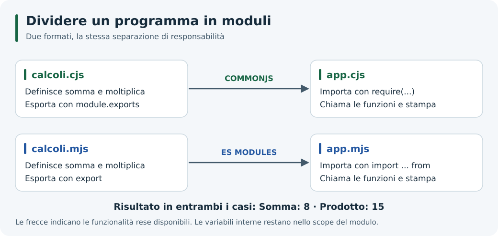
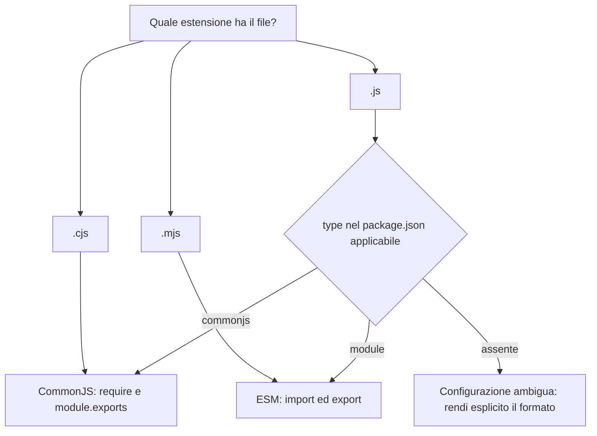

# 5. Moduli in Node.js: CommonJS ed ES Modules

## Obiettivi

Separare un programma in file con responsabilità chiare, esportare e importare funzionalità, scegliere esplicitamente il formato dei moduli e riconoscere i principali errori di caricamento.

## Un modulo è un confine nel programma

Un modulo contiene codice e decide quali funzionalità rendere disponibili agli altri moduli. Le variabili locali restano nel suo **scope**, cioè nell'ambito in cui sono accessibili; le esportazioni costituiscono la sua interfaccia.

Per esempio, `calcoli` può offrire una funzione `somma`, mentre `app` si occupa di chiamarla e stampare il risultato. In questo modo puoi cambiare l'organizzazione interna dei calcoli senza riscrivere ogni punto del programma che li usa.



*Il modulo dei calcoli espone funzioni; il modulo applicativo le usa e mostra il risultato.*

## Due classificazioni diverse

La **provenienza** di un modulo è distinta dal **formato** con cui viene scritto.

| Provenienza | Esempio | Installazione necessaria? |
| --- | --- | --- |
| Integrato in Node.js | `node:path`, `node:fs`, `node:http` | No |
| Locale, scritto nel progetto | `./calcoli.cjs` | No |
| Pacchetto esterno | Un pacchetto gestito con npm | Sì, se non già presente nel progetto |

Il prefisso `node:` identifica esplicitamente i moduli integrati. Un pacchetto può contenere più moduli e risorse: “pacchetto” e “singolo file” non sono sinonimi.

I due formati principali sono **CommonJS (CJS)** ed **ECMAScript Modules (ESM)**. Entrambi permettono di organizzare il codice, con regole differenti.

## 1. Laboratorio CommonJS

Crea una cartella di lavoro `laboratorio-moduli` e aprila nel terminale:

```bash
mkdir laboratorio-moduli
cd laboratorio-moduli
```

Salva i due file seguenti nella cartella. Usiamo l'estensione `.cjs` per indicare CommonJS senza dipendere da altre impostazioni del progetto.

**`calcoli.cjs`**

```javascript
function somma(a, b) {
  return a + b;
}

function moltiplica(a, b) {
  return a * b;
}

module.exports = { somma, moltiplica };
```

**`app.cjs`**

```javascript
const { somma, moltiplica } = require('./calcoli.cjs');

console.log('Somma:', somma(5, 3));
console.log('Prodotto:', moltiplica(5, 3));
```

Esegui:

```bash
node app.cjs
```

Risultato atteso:

```text
Somma: 8
Prodotto: 15
```

`module.exports` è il valore reso disponibile dal modulo; `require()` lo carica. `./` indica un percorso relativo al file che importa. Senza `./`, Node.js cercherebbe un modulo integrato o un pacchetto, non lo stesso file locale.

### module.exports ed exports

All'inizio di un modulo CommonJS, `exports` si riferisce allo stesso oggetto di `module.exports`. Puoi quindi aggiungere una proprietà con `exports.somma = somma`. Per sostituire l'intera esportazione devi invece assegnare a `module.exports`.

Questi frammenti illustrano **alternative**, non istruzioni da concatenare:

```javascript
// Aggiunge una proprietà all'oggetto esportato:
exports.somma = (a, b) => a + b;
```

```javascript
// Sostituisce il valore esportato con una funzione:
module.exports = (a, b) => a + b;
```

```javascript
// Errore didattico: cambia solo la variabile locale exports.
// Chi importa non riceve questo nuovo oggetto.
exports = { somma: (a, b) => a + b };
```

La seconda alternativa richiede un'importazione come `const somma = require('./calcoli.cjs')`, perché il valore esportato è direttamente la funzione.

Il wrapper CommonJS fornisce al modulo anche `require`, `module`, `__filename` e `__dirname`. Questi nomi non sono automaticamente disponibili negli ES Modules. Vedi la [documentazione CommonJS](https://nodejs.org/api/modules.html#the-module-wrapper).

## 2. Lo stesso programma con ES Modules

Nella stessa cartella crea altri due file. `.mjs` indica esplicitamente un ES Module.

**`calcoli.mjs`**

```javascript
export function somma(a, b) {
  return a + b;
}

export function moltiplica(a, b) {
  return a * b;
}
```

**`app.mjs`**

```javascript
import { somma, moltiplica } from './calcoli.mjs';

console.log('Somma:', somma(5, 3));
console.log('Prodotto:', moltiplica(5, 3));
```

Esegui `node app.mjs`: il risultato è identico alla versione CommonJS.

Le parentesi graffe selezionano le **esportazioni nominate**. Esiste anche l'esportazione `default`, importata senza graffe: i due stili non sono intercambiabili.

Le importazioni statiche ESM vanno al livello principale del modulo. Per caricare un modulo durante l'esecuzione si può usare `import()`, che restituisce una Promise; è disponibile anche da CommonJS. Le importazioni relative ESM richiedono l'estensione del file e non cercano automaticamente `index.js` dentro una cartella. Consulta le [regole ESM](https://nodejs.org/api/esm.html#mandatory-file-extensions).

## 3. Come Node.js interpreta i file .js

| File o configurazione | Formato |
| --- | --- |
| File `.cjs` | CommonJS |
| File `.mjs` | ES Module |
| File `.js` con `"type": "commonjs"` nel `package.json` applicabile | CommonJS |
| File `.js` con `"type": "module"` nel `package.json` applicabile | ES Module |

Per un file `.js`, conta il `package.json` più vicino risalendo le cartelle secondo le regole dei pacchetti. Le versioni moderne possono rilevare sintassi ESM in file ambigui: nei progetti didattici rendi esplicita la scelta. Vedi la [documentazione sui formati dei pacchetti](https://nodejs.org/api/packages.html#determining-module-system).



L'ultimo ramo è un consiglio per configurare il progetto, non l'algoritmo completo di rilevamento di Node.js.

Per provare ESM con `.js`, crea una **nuova sottocartella** `versione-js` e inserisci questo `package.json`:

```json
{
  "name": "laboratorio-moduli",
  "private": true,
  "type": "module"
}
```

Copia al suo interno `calcoli.mjs` e `app.mjs`, rinominandoli `calcoli.js` e `app.js`. Modifica anche l'importazione in `app.js` affinché punti a `./calcoli.js`. Dalla cartella `versione-js`, esegui `node app.js`.

Non serve `npm install`: non ci sono dipendenze esterne. Il campo `type` configura l'interpretazione dei file, non scarica librerie.

## 4. Percorsi: modulo locale o file di dati?

| Espressione | Risoluzione |
| --- | --- |
| `require('./calcoli.cjs')` | Rispetto al modulo CommonJS che importa |
| `import ... from './calcoli.mjs'` | Rispetto al modulo ESM che importa |
| `readFile('./dati.txt', ...)` | Rispetto a `process.cwd()` |
| `new URL('./dati.txt', import.meta.url)` | Rispetto al modulo ESM corrente |

In CommonJS puoi costruire il percorso di un file di dati con `path.join(__dirname, 'dati.txt')`. In ESM puoi passare a molte API del file system un URL costruito con `new URL(...)`, come nella [guida sul runtime](./03-javascript-runtime.md).

CommonJS supporta anche alcune convenzioni per caricare cartelle, tra cui il campo `main` e il ripiego su `index.js`. Per questi laboratori preferisci il nome completo del file: rende visibile quale modulo viene caricato.

## 5. Cache e stato condiviso

Un modulo CommonJS normalmente viene eseguito una volta per file risolto, nello stesso processo. Successive chiamate a `require()` riutilizzano l'esportazione in cache.

Crea **`contatore.cjs`**:

```javascript
console.log('Inizializzo il contatore');
let valore = 0;

module.exports = {
  incrementa() {
    valore += 1;
    return valore;
  },
};
```

Crea **`prova-cache.cjs`**:

```javascript
const primo = require('./contatore.cjs');
const secondo = require('./contatore.cjs');

console.log('Stesso oggetto:', primo === secondo);
console.log(primo.incrementa());
console.log(secondo.incrementa());
```

Esegui `node prova-cache.cjs`:

```text
Inizializzo il contatore
Stesso oggetto: true
1
2
```

Il valore locale non è accessibile direttamente, ma entrambe le importazioni agiscono sullo stesso stato. Avviando un altro processo con `node prova-cache.cjs`, il conteggio riparte. Anche ESM ha una cache, con regole proprie: non va confusa con `require.cache`. La [documentazione della cache CommonJS](https://nodejs.org/api/modules.html#caching) descrive anche i casi particolari.

### Oggetti indipendenti con una factory

Se vuoi due contatori indipendenti, esporta una funzione che li crea. Salva **`crea-contatore.cjs`**:

```javascript
module.exports = function creaContatore() {
  let valore = 0;
  return {
    incrementa() {
      valore += 1;
      return valore;
    },
  };
};
```

In **`prova-factory.cjs`**:

```javascript
const creaContatore = require('./crea-contatore.cjs');
const primo = creaContatore();
const secondo = creaContatore();

console.log(primo.incrementa());
console.log(primo.incrementa());
console.log(secondo.incrementa());
```

`node prova-factory.cjs` stampa `1`, `2`, `1`, ciascuno su una riga. La funzione esportata viene riutilizzata, ma ogni sua chiamata crea un nuovo stato.

## Quale formato scegliere?

Segui il formato già adottato dal progetto. Per sperimentare, `.cjs` e `.mjs` permettono di confrontare i due sistemi senza ambiguità. In un nuovo progetto ESM, dichiara `"type": "module"` se vuoi usare `.js`.

Evita di mescolare casualmente `require` e `import`: l'interoperabilità esiste, ma dipende dal tipo di esportazioni, dalla versione e dall'eventuale uso di `await` al livello principale. ESM non rende automaticamente parallelo il codice; il *tree-shaking* è un'ottimizzazione di strumenti di build, non qualcosa che Node.js applica da solo quando esegui un modulo.

## Errori frequenti

| Errore o sintomo | Possibile causa e controllo |
| --- | --- |
| `MODULE_NOT_FOUND` o `ERR_MODULE_NOT_FOUND` | File assente, percorso errato, estensione ESM mancante oppure pacchetto non installato |
| `require is not defined in ES module scope` | Stai usando `require` in ESM: adotta `import` oppure scegli CommonJS |
| `Cannot use import statement outside a module` | Il file viene interpretato come CommonJS: verifica estensione e `type` |
| Un'esportazione è `undefined` | Controlla nome, forma dell'esportazione e possibili riassegnazioni di `exports` |
| `does not provide an export named ...` | L'importazione nominata non corrisponde a un'esportazione del modulo |
| Un contatore viene condiviso inaspettatamente | Il modulo restituisce lo stesso oggetto dalla cache; valuta una factory |

## Esercizio finale

Aggiungi `media(numeri)` a entrambe le versioni di `calcoli`. Per questo esercizio considera valido un array non vuoto di numeri; se l'array è vuoto, genera un errore con `throw new Error('Array vuoto')`.

Verifica questi risultati:

| Chiamata | Risultato |
| --- | --- |
| `media([6, 8, 10])` | `8` |
| `media([7])` | `7` |
| `media([])` | Errore `Array vuoto` |

<details>
<summary>Soluzione e indicazioni per esportarla</summary>

```javascript
function media(numeri) {
  if (numeri.length === 0) {
    throw new Error('Array vuoto');
  }
  const totale = numeri.reduce((somma, numero) => somma + numero, 0);
  return totale / numeri.length;
}
```

In CommonJS aggiungi `media` all'oggetto `module.exports`. In ESM anteponi `export` alla dichiarazione. Aggiorna l'importazione nel rispettivo file `app` e prova i casi indicati. Per osservare l'errore senza interrompere il resto delle prove, racchiudi la chiamata con array vuoto in `try`/`catch`.

</details>

## Navigazione

- [Indice dell'unità](./README.md)
- [Guida precedente: REPL](./04-repl.md)
- [Unità successiva: Architettura Event-Driven](../02-Architettura_Event-Driven/README.md)
- [Approfondimento successivo: Moduli personalizzati](../04-ModuliPersonalizzati/README.md)
