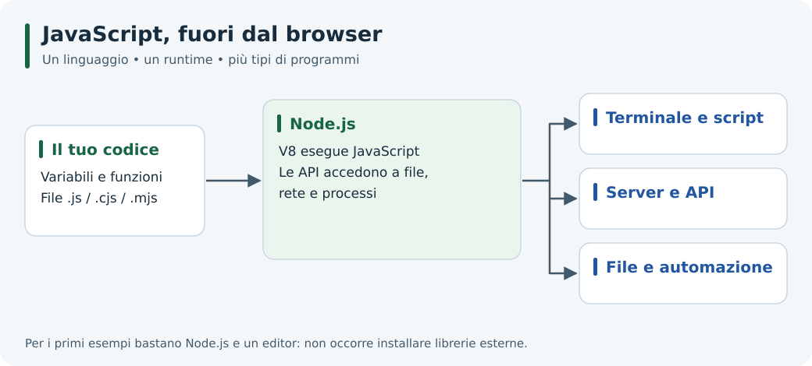
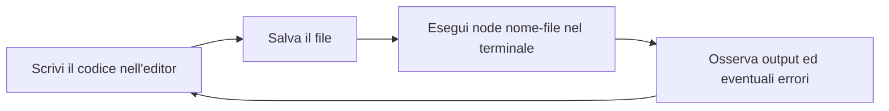

# Esercitazione 1: Introduzione a Node.js

Node.js permette di eseguire JavaScript fuori dal browser. In questa unità passerai dal primo comando nel terminale a un piccolo programma suddiviso in moduli, imparando a distinguere linguaggio, runtime e operazioni asincrone.



*Node.js collega il codice JavaScript alle risorse del sistema.*

## Prerequisiti e obiettivi

Sono sufficienti le basi di JavaScript: variabili, funzioni, array e oggetti. Servono un editor di testo e un terminale; gli esempi introduttivi non richiedono pacchetti esterni.

Al termine saprai:

- verificare l'installazione di Node.js ed eseguire uno script;
- distinguere Node.js, V8 e npm;
- spiegare perché un timer non interrompe il codice in esecuzione;
- utilizzare il REPL per fare esperimenti;
- creare e importare moduli CommonJS ed ES Modules.

## Percorso di studio

| Guida | Domanda a cui risponde | Attività |
| --- | --- | --- |
| [1. Storia e caratteristiche](./01-storia.md) | Perché nasce Node.js e dove è utile? | Scegliere un caso d'uso motivandolo |
| [2. Architettura](./02-architettura.md) | Come coordina JavaScript e I/O? | Prevedere l'ordine di esecuzione |
| [3. JavaScript runtime](./03-javascript-runtime.md) | Quali API offre rispetto al browser? | Leggere argomenti e file |
| [4. REPL](./04-repl.md) | Come sperimentare senza creare un programma? | Valutare espressioni e importare moduli |
| [5. Moduli in Node.js](./05-moduli-in-node.md) | Come si divide il codice in più file? | Costruire una piccola calcolatrice |

## 1. Preparare l'ambiente

Installa una versione **LTS ancora supportata** seguendo la [pagina ufficiale di download](https://nodejs.org/en/download) per il tuo sistema operativo. LTS significa *Long Term Support*: il [calendario dei rilasci](https://nodejs.org/en/about/previous-releases) permette di verificarne il periodo di supporto. Queste guide usano funzionalità disponibili in Node.js 24 LTS.

Apri un nuovo terminale dopo l'installazione ed esegui:

```bash
node --version
npm --version
```

Entrambi i comandi devono stampare un numero di versione. `node` esegue JavaScript; `npm` gestisce i pacchetti ed è distribuito con le installazioni standard di Node.js.

Se il comando non viene riconosciuto, verifica l'installazione e il `PATH`, cioè l'elenco delle cartelle in cui il terminale cerca gli eseguibili. Se il repository è già aperto nel container di sviluppo, controlla prima le versioni disponibili: potrebbe non servire un'altra installazione.

## 2. Eseguire il primo script

Dalla radice del repository entra nella cartella dell'unità:

```bash
cd docs_nodejs-by-example/01-Introduzione
node esempi/01-hello.js
```

Risultato atteso:

```text
Hello, Node.js!
```

Apri [esempi/01-hello.js](./esempi/01-hello.js): `console.log()` stampa il messaggio nel terminale. Modifica il saluto, salva il file ed eseguilo di nuovo. Un file salvato non viene eseguito automaticamente.



Questo è il ciclo di lavoro degli esercizi: ogni modifica richiede un salvataggio e una nuova esecuzione.

Per tutti i comandi di questa pagina, resta nella cartella `01-Introduzione`. Quando una guida chiede di creare un file, salva il blocco di codice con il nome indicato e avvia `node` dalla cartella che lo contiene.

## 3. Passare argomenti al programma

```bash
node esempi/parametri.js Anna Rossi 18
node esempi/saluto.js "Anna Rossi"
node esempi/node-info.js
```

Nel primo comando, `process.argv[2]`, `[3]` e `[4]` valgono rispettivamente `Anna`, `Rossi` e `18`. Gli argomenti arrivano come **stringhe**. Le virgolette nel secondo comando mantengono insieme le parole del nome. Il saluto varia con l'ora; l'ultimo script mostra dati dipendenti dal tuo ambiente.

Altri esempi disponibili:

- [parmetri2.mjs](./esempi/parmetri2.mjs): stampa tutti gli argomenti usando un ES Module; il nome del file nel repository è proprio `parmetri2.mjs`.
- [fibonacci.js](./esempi/fibonacci.js): genera i primi dieci termini di Fibonacci; servirà per ragionare sui calcoli eseguiti dal thread principale.

## 4. Provare il REPL

Digita `node` senza un nome di file. Nel prompt `>` scrivi `2 + 3`: il risultato è `5`. Digita `.exit` per tornare al terminale.

| Dove ti trovi | Cosa puoi digitare |
| --- | --- |
| Terminale del sistema | `node esempi/01-hello.js`, `npm --version`, `cd ...` |
| REPL, riconoscibile dal prompt `>` | `2 + 3`, `process.version`, `.help`, `.exit` |
| Editor di testo | Il codice JavaScript da salvare in un file |

Non digitare `node file.js` nel REPL: è un comando del terminale.

## Laboratorio e verifica finale

Segui le cinque guide e completa gli esercizi proposti. Poi verifica di riuscire a:

1. eseguire `01-hello.js` e spiegare dove compare il messaggio;
2. leggere un nome da `process.argv` e stampare un saluto;
3. prevedere l'output dell'esempio con `setTimeout()` nella guida sull'architettura;
4. importare `node:path` nel REPL e chiamarne una funzione;
5. eseguire la calcolatrice sia in CommonJS sia in ESM.

Materiale per l'attività in classe: [ES01 - Introduzione a Node](https://docs.google.com/presentation/d/1ZB6qUwG6CxxarcsVaAvTSR7DyaWXR5slIHf0qLfA1Cw).

## Problemi frequenti

| Problema | Controllo da fare |
| --- | --- |
| `node` non riconosciuto | Riapri il terminale e verifica installazione e `PATH` |
| `Cannot find module ...` avviando uno script | Controlla cartella corrente, nome ed estensione del file |
| `ReferenceError: document is not defined` | Stai usando un'API del DOM, assente in Node.js |
| `require is not defined in ES module scope` | Controlla estensione e campo `type`: vedi la guida sui moduli |
| Il programma non termina | Verifica se sono ancora attivi server, intervalli o altre risorse |

## Navigazione

- [Indice del corso](../README.md)
- [Prima guida: storia e caratteristiche](./01-storia.md)
- [Unità successiva: Architettura Event-Driven](../02-Architettura_Event-Driven/README.md)
